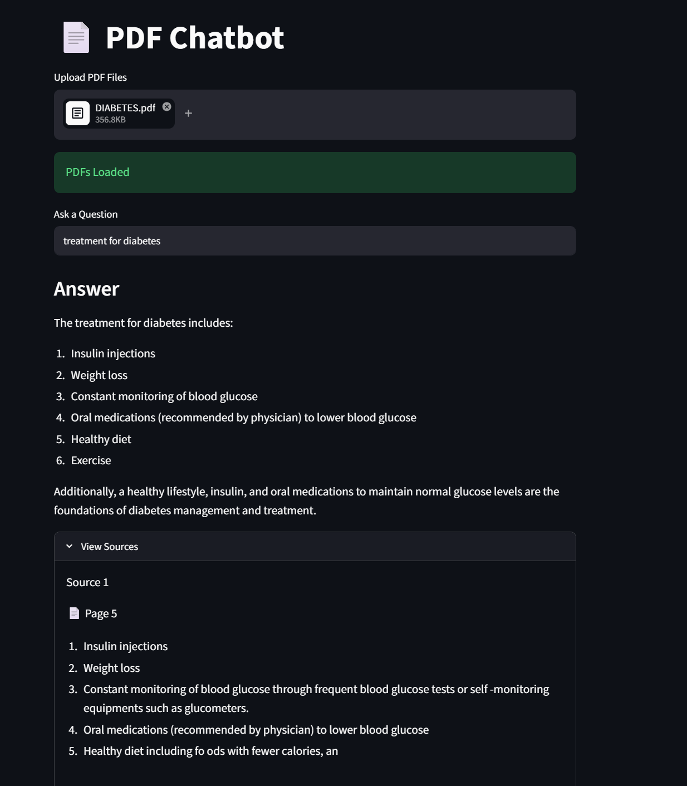

# 📄 PDF Chatbot using Streamlit, LangChain, FAISS, Hugging Face & Groq

## Overview

This project is a Retrieval-Augmented Generation (RAG) based PDF Chatbot built using Streamlit, LangChain, FAISS, Hugging Face Embeddings, and Groq LLMs.

The application allows users to upload one or multiple PDF documents and ask questions about their contents. The chatbot retrieves the most relevant sections from the uploaded PDFs and generates accurate answers using the Groq-hosted Llama 3.3 model.

---

## Features

* Upload multiple PDF files
* Extract text from PDFs
* Split documents into smaller chunks
* Generate embeddings using Hugging Face
* Store embeddings in a FAISS vector database
* Perform semantic search on PDF content
* Answer questions using Groq Llama 3.3 70B model
* Maintain chat history during the session
* Display source pages used to generate answers



---

## Architecture

User Uploads PDF(s)
↓
PyPDFLoader
↓
Text Chunking
↓
Hugging Face Embeddings
↓
FAISS Vector Store
↓
Similarity Search
↓
Groq LLM
↓
Answer Generation

---

## Technologies Used

### Frontend

* Streamlit

### Document Processing

* LangChain
* PyPDFLoader

### Text Splitting

* RecursiveCharacterTextSplitter

### Embeddings

* sentence-transformers/all-MiniLM-L6-v2
* HuggingFaceEmbeddings

### Vector Database

* FAISS

### Large Language Model

* Groq
* Llama-3.3-70B-Versatile

---

## Project Structure

```text
project/
│
├── app.py
├── requirements.txt
├── .streamlit/
│   └── secrets.toml
└── README.md
```

---

## Installation

### Clone Repository

```bash
git clone https://github.com/yourusername/pdf-chatbot.git

cd pdf-chatbot
```

### Create Virtual Environment

```bash
python -m venv venv
```

### Activate Environment

Windows

```bash
venv\Scripts\activate
```

Linux / Mac

```bash
source venv/bin/activate
```

### Install Dependencies

```bash
pip install -r requirements.txt
```

---

## Required Packages

```bash
streamlit
langchain
langchain-community
langchain-text-splitters
langchain-groq
faiss-cpu
sentence-transformers
pypdf
torch
```

---

## Configure Groq API Key

Create the following file:

```text
.streamlit/secrets.toml
```

Add:

```toml
GROQ_API_KEY="your_groq_api_key"
```

---

## Run the Application

```bash
streamlit run app.py
```

The application will start at:

```text
http://localhost:8501
```

---

## How It Works

### Step 1: Upload PDFs

Users upload one or more PDF files.

### Step 2: Text Extraction

PyPDFLoader extracts text from each PDF page.

### Step 3: Chunking

Documents are split into smaller chunks:

```python
chunk_size=500
chunk_overlap=50
```

### Step 4: Embedding Generation

Each chunk is converted into vector embeddings using:

```python
sentence-transformers/all-MiniLM-L6-v2
```

### Step 5: Vector Storage

Embeddings are stored in FAISS for fast similarity search.

### Step 6: Retrieval

When a question is asked:

```python
db.similarity_search(question, k=3)
```

retrieves the top 3 most relevant chunks.

### Step 7: Answer Generation

Retrieved chunks are provided as context to:

```python
llama-3.3-70b-versatile
```

which generates a final answer.

---

## Example Usage

1. Upload a PDF research paper.
2. Ask:

```text
What is the main objective of this paper?
```

3. Ask:

```text
What methodology was used?
```

4. View the source pages used to generate answers.

---

## Future Improvements

* Conversational memory
* Chat-style UI
* Persistent vector database
* PDF summarization
* Citation generation
* Multi-model support
* Document comparison
* OCR support for scanned PDFs

---

## Learning Concepts Demonstrated

* Retrieval-Augmented Generation (RAG)
* Vector Databases
* Semantic Search
* Embeddings
* Large Language Models (LLMs)
* Prompt Engineering
* LangChain Pipelines
* Streamlit Application Development

---

## Author

Amrutha Thalla

Full Stack .NET Developer | AI & Generative AI Enthusiast

---

## License

This project is intended for educational and learning purposes.
