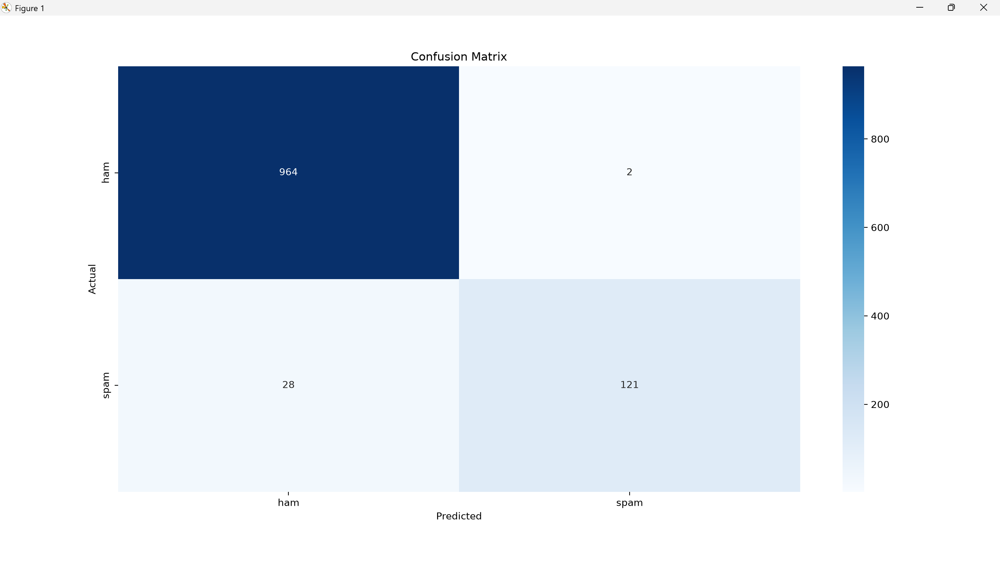

# SMS Spam Classifier (Classical ML, TF-IDF + Naive Bayes)

A text classification project that distinguishes spam from legitimate ("ham") SMS messages, using classical machine learning rather than a neural network or LLM — a deliberate contrast to the generative/LLM-based projects elsewhere in this portfolio.

## Why this project

My other projects (a RAG system, and a LoRA fine-tuning experiment) are both built on generative language models. This project rounds out the picture by demonstrating the other major branch of NLP: discriminative classification, where the goal is a label, not generated text — and by using a simpler, older technique (TF-IDF) instead of dense neural embeddings, as a deliberate point of comparison.

## Dataset

The SMS Spam Collection dataset: 5,572 SMS messages labeled `ham` or `spam`. The dataset is imbalanced — about 87% ham, 13% spam — which matters directly for how the results should be read (see below).

## How it works

1. **Train/test split** : data is split 80/20 *before* any feature extraction, so the test set stays genuinely unseen until final evaluation.
2. **Feature extraction (TF-IDF)** : each message is converted into a vector of word-importance scores. TF-IDF downweights common words ("the," "is") and upweights words that are distinctive within a message relative to the whole corpus (e.g. "free," "winner," "claim" — words that disproportionately appear in spam).
3. **Classifier (Multinomial Naive Bayes)** : a fast, well-established baseline for text classification with word-frequency-style features. It estimates the probability of each class from word frequencies seen during training, under a simplifying ("naive") assumption that words appear independently of each other.
4. **Evaluation** : precision, recall, F1-score, and a confusion matrix on the held-out test set — not just accuracy, for reasons explained below.

## Results

| Metric    | ham  | spam |
| --------- | ---- | ---- |
| Precision | 0.97 | 0.98 |
| Recall    | 1.00 | 0.81 |
| F1-score  | 0.98 | 0.89 |

Overall accuracy: 97% (1115 test messages)

Confusion matrix:

|                       | Predicted ham | Predicted spam |
| --------------------- | ------------- | -------------- |
| **Actual ham**  | 964           | 2              |
| **Actual spam** | 28            | 121            |

## Why accuracy alone is misleading here

The dataset is roughly 87% ham. A model that always predicted "ham" would already score 87% accuracy while being completely useless. This is why the project reports precision, recall, and a confusion matrix instead of leaning on the overall accuracy number alone.

## The real finding: a precision/recall asymmetry

The model is precision-heavy on spam (0.98) but recall-lighter (0.81): only 2 of 966 real messages were wrongly flagged as spam, but 28 of 149 actual spam messages were missed. This is a direct consequence of the class imbalance — with far more ham examples to learn from, the model leans toward predicting ham when uncertain.

In a real deployment, this is a genuine design tradeoff, not just a number to improve blindly: a stricter filter would catch more spam at the cost of blocking more real messages (lower precision); the current model protects real messages at the cost of letting more spam through (lower recall). Which tradeoff is "better" depends on the product — e.g., a banking fraud filter might prioritize recall (catch everything suspicious) even at some precision cost, while a personal messaging app might prioritize precision (never block a real message from a friend).

## What I'd improve with more time

* Tune the classification threshold explicitly to explore the precision/recall tradeoff quantitatively, rather than accepting the model's default decision boundary.
* Compare Naive Bayes against a couple of other classical baselines (e.g. logistic regression, linear SVM) on the same TF-IDF features.
* Inspect the 28 missed spam messages directly to see if they share a pattern (e.g. shorter messages, different vocabulary) the model is systematically blind to.

## Stack

Python, pandas, scikit-learn (TF-IDF, Naive Bayes, evaluation metrics), matplotlib/seaborn (confusion matrix visualization)
